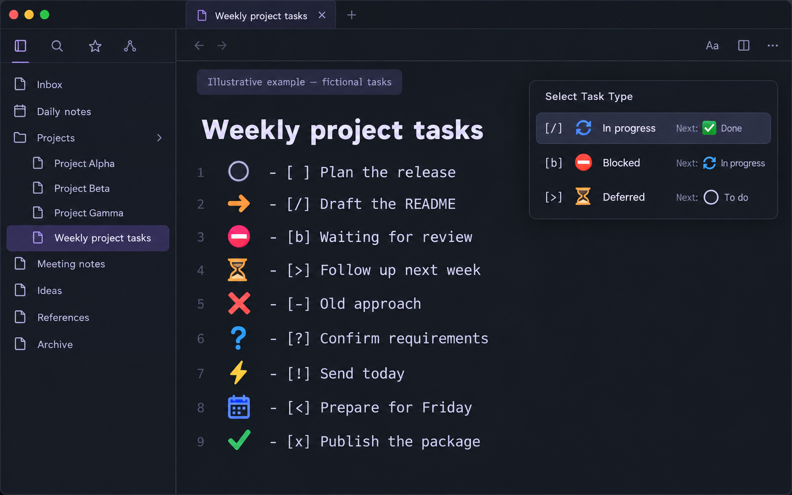

# Obsidian Task Workflow

A portable Agent Skill and installer for a clear, multi-state Obsidian task workflow. It works in any vault and displays large standalone icons rather than small checkbox marks. No AI tool or npm packages are required.

## Quick start

**Requirements:** Obsidian, Node.js 18 or later (`node --version`), internet access for the first installation, and permission to use Obsidian community plugins.

1. Quit Obsidian.
2. Download this repository as a ZIP from GitHub and unzip it, or clone your copy:

   ```sh
   git clone https://github.com/frostymccool/obsidian-task-workflow.git
   ```

3. From the downloaded folder, run:

   ```sh
   node /path/to/obsidian-task-workflow/install-task-workflow.mjs "/full/path/to/your/vault"
   ```

   The vault path must be the folder that contains its `.obsidian` directory.

4. Reopen Obsidian. If **Restricted mode** is on, turn it off in **Settings → Community plugins** so the three required plugins can run.

On a fresh vault, the installer downloads the official releases of [Tasks](https://github.com/obsidian-tasks-group/obsidian-tasks) and [Task Status](https://github.com/vburzynski/obsidian-task-status), enables both, configures the nine-item right-click/long-press picker, installs the bundled **Task Workflow Sorter**, merges only workflow-owned task statuses, copies `task-workflow.css` into `.obsidian/snippets/`, and enables that snippet. Existing third-party plugin files are left in place rather than upgraded automatically.

Run `node install-task-workflow.mjs --help` to see every available command.

### Remember a default vault

```sh
node install-task-workflow.mjs --set-default "/full/path/to/your/vault"
node install-task-workflow.mjs --use-default --yes
```

The default path lives in `~/.obsidian-task-workflow.json`, outside this repository. The explicit `--yes` prevents accidental installation into the saved vault.

### MCP-only agents

An Obsidian MCP server alone cannot reliably install this workflow: the installer must update hidden `.obsidian` configuration and CSS files. An MCP-only agent can create a setup note and provide the command, but it must not report success until a process with filesystem access has run the installer.

## Keep it updated with BRAT

BRAT can keep the workflow's custom Obsidian plugin up to date. **Run the Quick start installer once first**: it installs and configures the required Tasks and Task Status plugins. BRAT then updates the workflow's visual styles and deferred-task sorter without a repeat installation.

1. Install [BRAT](https://github.com/TfTHacker/obsidian42-brat) from Obsidian's Community plugins browser and enable it.
2. Open the Command palette and run **BRAT: Add a beta plugin for testing**.
3. Enter this repository path:

   ```text
   frostymccool/obsidian-task-workflow
   ```

4. Leave it on BRAT's normal update schedule, or use BRAT's update command whenever you want the latest version.

BRAT installs the plugin as `task-workflow-sorter`, matching the ID already used by the installer. It therefore updates the existing sorter rather than adding a duplicate. Each GitHub release includes the exact `main.js`, `manifest.json`, and `styles.css` files BRAT requires.

| BRAT updates | Still handled by the one-time installer or Obsidian |
| --- | --- |
| Large status icons and picker styling | First-time Tasks and Task Status installation/configuration |
| Deferred-task sorting | Updates to the Tasks and Task Status third-party plugins |
| The workflow plugin itself | Existing user-created task statuses outside this workflow |

## Use with any agent harness

The repository root is a standard Agent Skill folder (`SKILL.md` plus supporting files). Clone or symlink it into the skills location recognized by your harness:

- Codex: `~/.codex/skills/obsidian-task-workflow/`
- Claude Code: `~/.claude/skills/obsidian-task-workflow/`
- Cursor project skill: `.cursor/skills/obsidian-task-workflow/`
- Any other harness: place the folder wherever it discovers standard `SKILL.md` skills.

No harness is required to use it: anyone with Node.js can run `install-task-workflow.mjs` directly from a clone.

## Repository layout

```text
SKILL.md                     Harness-neutral instructions
install-task-workflow.mjs    Dependency-free installer (Node.js standard library only)
main.js, manifest.json       BRAT/Obsidian plugin release assets
styles.css                   BRAT-loaded status styling
task-workflow.css            Visual status definitions
task-workflow-sorter/        Bundled plugin that moves deferred tasks to a list's bottom
```

## What the installer changes

It writes only inside the selected vault's `.obsidian` folder: community-plugin settings, Tasks settings, Task Status settings, the bundled sorter plugin, and `snippets/task-workflow.css`. Before changing an existing JSON settings file, it creates a sibling `*.before-task-workflow-pack.bak` backup. It does not modify notes, delete settings, or upgrade already-installed third-party plugins.

## See it in action



_Illustrative example only — it is a fabricated demo, not a screenshot of a real vault._

## Everyday use

Start an ordinary task as `- [ ] Plan the release`. A normal checkbox click follows the configured next state: **To do → In progress → Done**.

When a task needs a different outcome, right-click its checkbox (or long-press for 500 ms) and choose **Select Task Type**. Each row shows the Markdown marker, its large visual icon, and what the next normal click will do.

```markdown
- [ ] Plan the release                 # ○ To do
- [/] Draft the README                  # 🔄 In progress
- [b] Waiting for review                # ⛔ Blocked
- [>] Follow up next week               # ⏳ Deferred — moves to this list's bottom
- [-] Old approach                      # ❌ Cancelled
- [?] Confirm requirements              # ❓ Needs clarification
- [!] Send today                        # ⚡ Urgent
- [<] Prepare for Friday                # 📅 Scheduled
- [x] Publish the package               # ✅ Done
```

You can also type a marker directly when editing Markdown. The workflow recognises it immediately; the bundled sorter moves a deferred task and any child tasks to the bottom of its current list.

## Current status set

| Status | Markdown | Icon |
| --- | --- | --- |
| In progress | `[/]` | 🔄 |
| Blocked | `[b]` | ⛔ |
| Deferred | `[>]` | ⏳ |
| Cancelled | `[-]` | large red × |
| Needs clarification | `[?]` | ❓ |
| Urgent | `[!]` | ⚡ |
| Scheduled | `[<]` | 📅 |
| Done | `[x]` | ✅ |

## Deferred-task ordering

Whenever a task becomes deferred (`[>]`), the bundled sorter moves it to the bottom of its current Markdown list. Subtasks move with their parent. Separate lists, blank-line boundaries, and fenced code examples are left alone.

## Status picker

Right-click or long-press a task checkbox to open **Select Task Type**. Every option shows its real Markdown marker, emoji, and the state reached by the next normal checkbox click—for example, `[/] 🔄 In progress — Next: ✅ Done`. The generic green picker ticks are intentionally hidden, so the marker is always unambiguous.

## Updating or removing

To update, download the newer package and run the same installer again for each vault, then restart Obsidian. Your existing non-workflow Tasks statuses are retained.

To remove it, disable **Task Workflow Sorter** and the `task-workflow` CSS snippet in Obsidian. You may then remove `.obsidian/plugins/task-workflow-sorter/` and `.obsidian/snippets/task-workflow.css`. Restore any `*.before-task-workflow-pack.bak` files if you want to revert the associated settings.

## Troubleshooting

- **“Not an Obsidian vault”** — provide the vault folder itself, not a note or a parent folder; it must already contain `.obsidian`.
- **Nothing changes after install** — fully quit and reopen Obsidian, and confirm Restricted mode is off.
- **Icons look like normal ticks** — verify that the `task-workflow` snippet is enabled in **Settings → Appearance → CSS snippets**.
- **Download fails** — check internet access, or install Tasks and Task Status from Obsidian's Community plugins browser, then rerun the installer.

## Sharing and licensing

This repository is intentionally free of personal vault paths and account-specific configuration. It is [MIT licensed](LICENSE), so you can fork, adapt, and share it. Third-party community plugins remain their own projects and licenses; this package downloads their official release assets at install time rather than bundling them. See [third-party notices](THIRD_PARTY_NOTICES.md).
